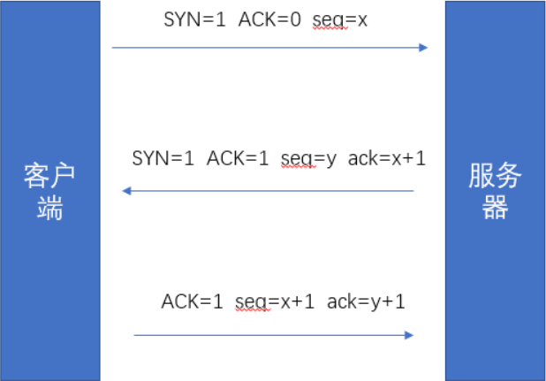
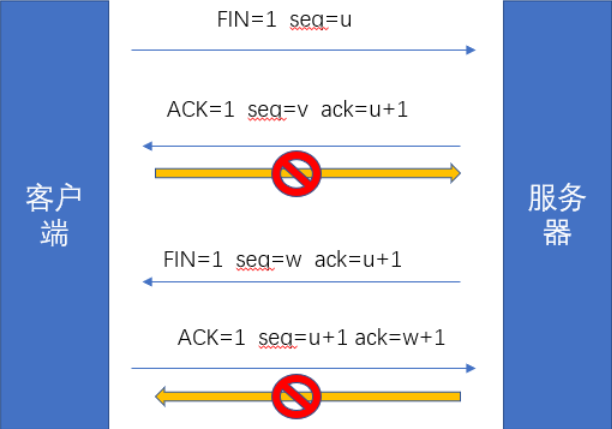

## TCP（Transmission Control Protocol）
TCP传输控制协议，是一种面向连接的、可靠的、基于字节流的传输层通信协议

### TCP三次握手过程
1. client 发送 syn 到server 发起握手；
2. server 收到 syn 后回复syn + ack 给client；
3. client 收到 syn + ack后，回复server一个ack表示收到了server的syn + ack

`SYN, ACK, FIN, seq, ack代表的含义:`
`SYN：代表请求创建连接，所以在三次握手中前两次要SYN=1，表示这两次用于建立连接`
`FIN：表示请求关闭连接，在四次分手时，FIN发了两遍。（TCP连接是双向的，一次FIN只能关闭一个方向）`
`ACK：确认接受`
`seq：序列号，对每个数据包进行编号`

TCP三次握手图片

### TCP四次挥手过程
1. 客户端请求关闭客户端到服务端方向的连接，这时客户端就要发送一个FIN = 1，表示要关闭一个方向上的连接；
2. 服务器端接收后确认一下，返回给客户端ACK=1;
3. 客户端向服务器端方向的连接关闭，服务器端向客户端方向的连接尚未关闭。故服务器端向客户端发送一个FIN=1 ACK=1；
4. 客户端接收后向服务器端发送 ACK=1，表示接收成功。

TCP四次挥手
