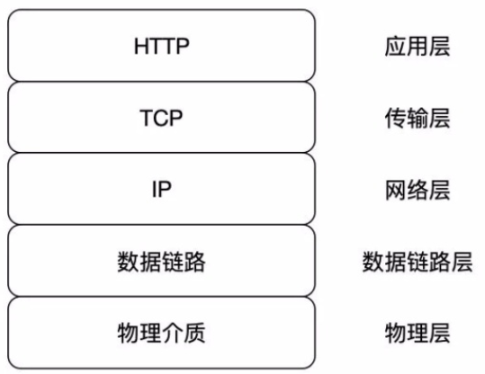
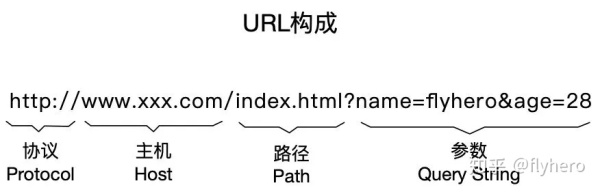

[面试记录来源](https://zhuanlan.zhihu.com/p/60450391)
### HTTP协议简介
HTTP（超文本传输协议）是应用层上的一种客户端/服务端模型的通信协议，它由请求和响应构成，且是无状态的。

+ 协议
    协议规定了通信双方都必须遵循的数据传输格式，这样通信双方按照约定格式才能准确地通信
+ 无状态
  无状态指的是两次连接之间是没有任何关系的，每次都是一个新的连接，服务器端不会记录前后连接的请求信息。

### 五层网络模型
从上到下：应用层、传输层、网络层、链路层、物理层

### URL的构成
URL由四部分构成：协议、主机、路径、参数
