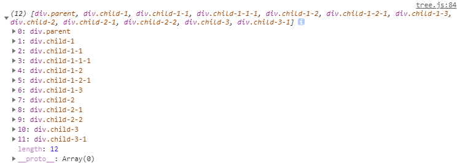
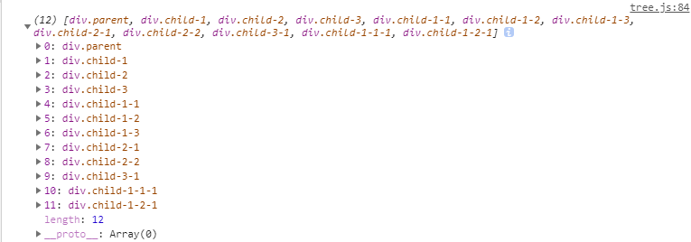

[题目来源及答案](https://github.com/Advanced-Frontend/Daily-Interview-Question/issues/9)
### DOM节点理解深度优先遍历和广度优先遍历
```html
<body>
    <div class="parent">
        <div class="child-1">
            <div class="child-1-1">
                <div class="child-1-1-1">
                    a
                </div>
            </div>
            <div class="child-1-2">
                <div class="child-1-2-1">
                    b
                </div>
            </div>
            <div class="child-1-3">
                c
            </div>
        </div>
        <div class="child-2">
            <div class="child-2-1">
                d
            </div>
            <div class="child-2-2">
                e
            </div>
        </div>
        <div class="child-3">
            <div class="child-3-1">
                f
            </div>
        </div>
    </div>
</body>
```

`下面，使用深度优先遍历和广度优先遍历对dom树进行查找`
### 深度优先遍历
深度优先遍历DFS与树的先序遍历比较类似:
+ 访问顶点v
+ 访问顶点v的一个邻接点
+ 访问邻接点的下一个邻接点
+ 再选择v其他未被访问的邻接点（再次进行2~4步骤）
```js
/* 深度优先的三种方式 */
// 第一种方式（递归）
let deepTraversal = (node, nodeList = []) => {
    if (node !== null) {
        nodeList.push(node);
        let children = node.children;
        for (let i = 0; i < children.length; i++) {
            deepTraversal(children[i], nodeList);
        }
    }

    return nodeList;
}

// 第二种方式（递归）
let deepTraversal2 = (node) => {
    let nodes = [];
    if (node !== null) {
        nodes.push(node);
        let children = node.children;
        for (let i = 0; i < children.length; i++) {
            nodes = nodes.concat(deepTraversal2(children[i]));
        }
    }

    return nodes;
}

// 第三种方式（非递归）
let deepTraversal3 = (node) => {
    let stack = [];
    let nodes = [];

    if (node) {
        stack.push(node);

        while (stack.length) {
            let item = stack.pop();
            nodes.push(item);
            
            let children = item.children;
            for (let i = 0; i < children.length; i++) {
                nodes.push(children[i]);
            }
        }
    }

    return nodes;
}
```
深度优先代码的输出结果为：


### 广度优先遍历
+ 访问顶点v
+ 访问v所有未被访问的邻接点
+ 分别从这些邻接点触发，访问它们的邻接点
```js
let widthTraversal = (node) => {
    let queue = [];
    let nodes = [];

    if (node !== null) {
        queue.push(node);

        while (queue.length) {
            let item = queue.shift();
            let children = item.children;
            nodes.push(item);

            for (let i = 0; i < children.length; i++) {
                queue.push(children[i]);
            }
        }
    }

    return nodes;
}
```
广度优先代码输出结果：
