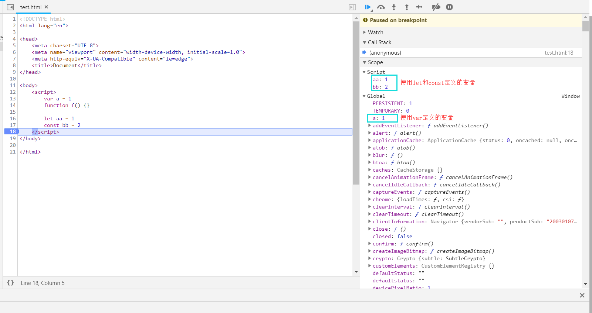

### 题目来源
[木易杨的每日一题](https://github.com/Advanced-Frontend/Daily-Interview-Question/issues/30)

### 题目答案
[题目issue区的回答](https://github.com/Advanced-Frontend/Daily-Interview-Question/issues/30#issue-417604589)

### ES5中的变量及函数
ES5 中，顶层对象的属性和全局变量是等价的，`var`命令和`function`命令声明的全局变量，自然也是顶层对象
```js
var a = 12
function f() {}

console.log(window.a)   // 12
console.log(window.f)   // f() {}
```

### ES6中的变量及函数
`var`和`function`命令声明的全局变量，依旧是顶层对象的属性，但`let`命令、`const`命令、`class`命令声明的全局变量，不属于顶层对象的属性
```js
let aa = 1
const bb = 2

console.log(window.aa)  // undefined
console.log(window.bb)  // undefined
```

### 两种声明变量的示意图（以浏览器为例）
