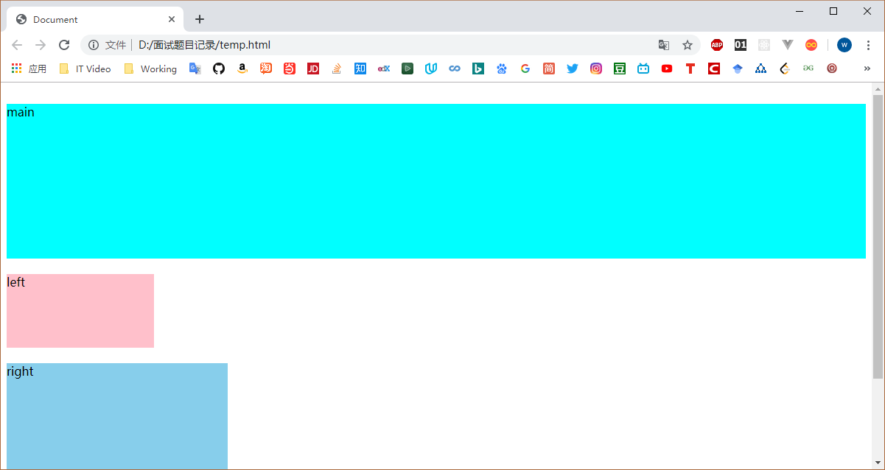

### 题目描述
使用不同的布局方式实现双飞翼布局（圣杯布局）

### 具体题目
针对如下DOM结构，编写CSS，实现三栏水平布局，其中left、right分别位于左右两侧，left宽度为200px，right宽度为300px，main处在中间，宽度自适应。
```html
<div class="container"> 
　　<div class="main">main</div> 
　　<div class="left">left</div> 
　　<div class="right">right</div> 
</div>
```

### 答案来源
[圣杯布局、双飞翼布局、Flex布局和绝对定位布局的几种经典布局的具体实现](https://blog.csdn.net/qq_42316954/article/details/80895902)

### 双飞翼布局的要求
+ 三列布局，中间宽度自适应，两边定宽
+ 中间栏要在浏览器中优先展示渲染
+ 允许任意列的高度最高

### 基本网页结构


### Flex实现双飞翼布局
```css
* {
    margin: 0;
    padding: 0;
    border: 0;
    box-sizing: border-box;
}
.container {
    display: flex;
    justify-content: space-around;
}

.right, .left {
    width: 200px;
    height: 200px;
    background-color: green;
}

.left {
    order: -1;
}

.main {
    height: 200px;
    flex-grow: 1;
    background-color: blue;
}
```

```html
<div class="container">
    <div class="main"></div>
    <div class="left"></div>
    <div class="right"></div>
</div>
```