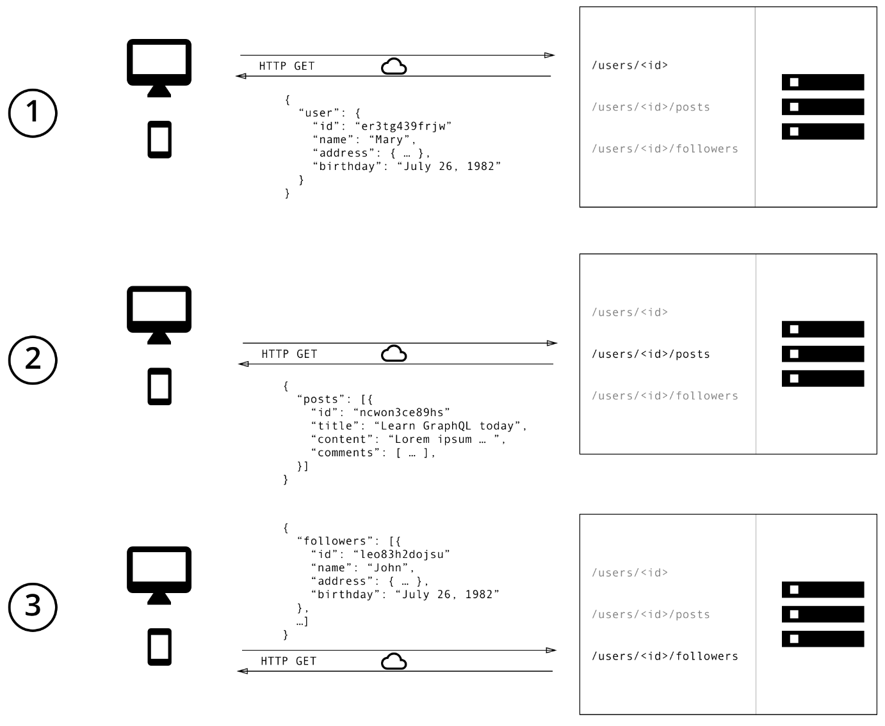
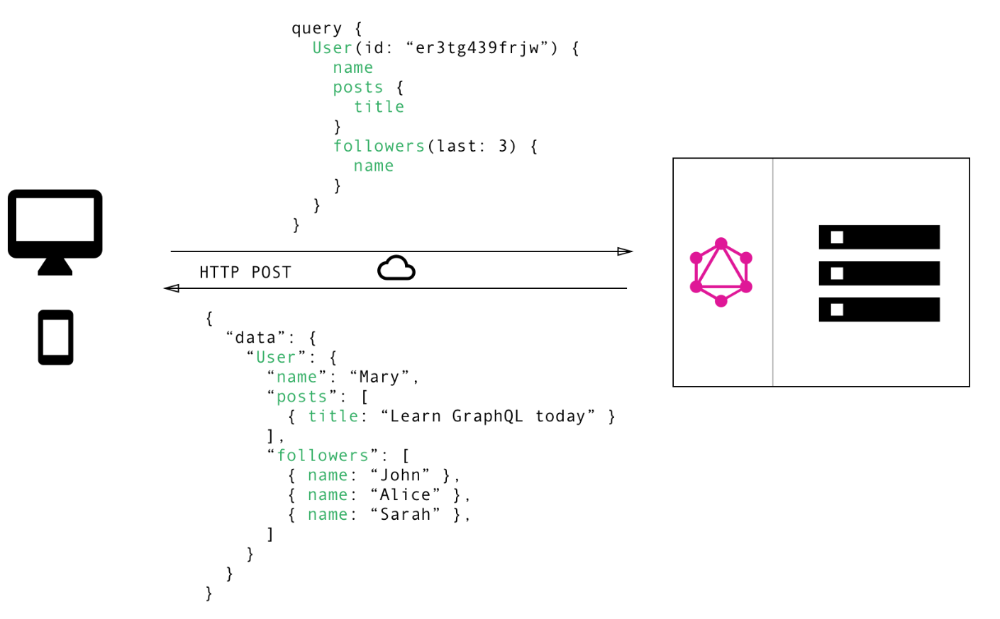

### Graphql的作用（官网解释）
一种数据查询语言
`Graph` + `QL` = 图标化的查询语言，是一种描述客户端如何向服务端请求数据的`API`语法，类似于`RESTful API`规范

### 设计初衷
设计者希望可以写一个和期待的返回数据`schema`差不多的查询

### Graphql的定位
`graphql`是一种请求数据的规范，其实现可以通过多种语言

### `graphql`与`restful`的区别
[本部分来源](https://www.cnblogs.com/Wolfmanlq/p/9094418.html)
`REST API`实现步骤:
1. 通过`/user/<id>`获取初始用户数据;
2. 通过`/user/<id>/posts`返回用户的所有帖子;
3. 请求`/user/<id>/followers`，返回每个用户的关注者列表

`rest API`的请求数据的关系图如图所示:

`GraphQL`只需要一次请求即可完成上述需求

`GraphQL`不用多取数据，也不用少取数据，只需按需获取即可
