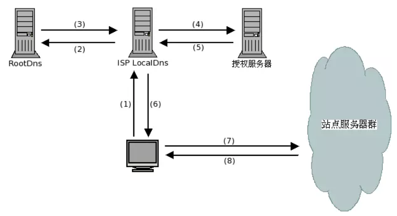
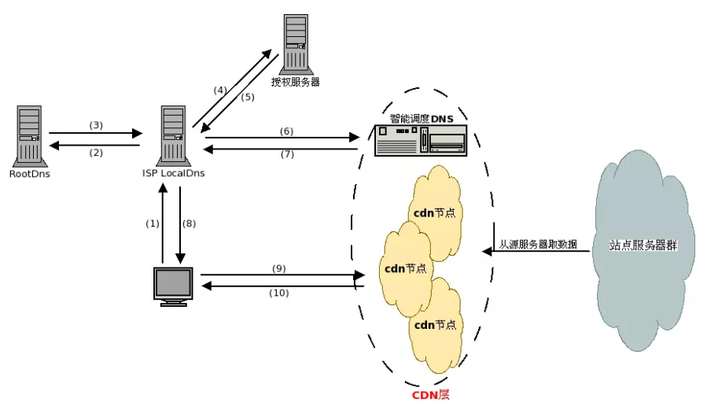

### 题目及答案来源
[网站建设——CDN及CDN加速原理](https://blog.csdn.net/luoweifu/article/details/51031099)

### 什么是`CDN`
`CDN`的全称是（Content Delivery Network），即内容分发网络

### `CDN`的作用
(1) 用户可以从就近的网络节点上取得所需的内容;
(2) 提高用户访问网站的响应速度;
(3) 从技术上全面解决由于网络带宽小、用户访问量大、网点分布不均等原因，提高用户访问网站的响应速度

### `CDN`的实现方式
通过在现有的`Internet`中增加一层新的`Cache`缓存层，将网站的内容发布到最接近用户的网络“边缘”节点上。

### 一言以蔽之
`CDN`的工作原理就是将开发者将源站的资源缓存到位于全球各地的`CDN`节点上，用户请求资源时，就近返回节点上缓存的资源

### `CDN`对网络的优化作用主要体现在以下几个方面
+ 解决服务器端的“第一公里”问题
+ 缓解甚至消除了不同运营商之间互联的瓶颈造成的影响
+ 减轻了各省的出口带宽压力
+ 缓解了骨干网的压力
+ 优化了网上热点内容的分布

### 传统的访问过程

由上图可知，用户访问未使用`CDN`缓存网站的过程为:
```
1. 用户输入访问的域名,操作系统向 LocalDns 查询域名的ip地址;
2. LocalDns向 ROOT DNS 查询域名的授权服务器(这里假设LocalDns缓存过期);
3. ROOT DNS将域名授权dns记录回应给 LocalDns;
4. LocalDns得到域名的授权dns记录后,继续向域名授权dns查询域名的ip地址;
5. 域名授权dns 查询域名记录后，回应给 LocalDns;
6. LocalDns 将得到的域名ip地址，回应给 用户端;
7. 用户得到域名ip地址后，访问站点服务器;
8. 站点服务器应答请求，将内容返回给客户端.
```

### 使用`CDN`缓存后的访问过程
'
```
1. 用户输入访问的域名,操作系统向 LocalDns 查询域名的ip地址;
2. LocalDns向 ROOT DNS 查询域名的授权服务器(这里假设LocalDns缓存过期);
3. ROOT DNS将域名授权dns记录回应给 LocalDns;
4. LocalDns得到域名的授权dns记录后,继续向域名授权dns查询域名的ip地址;
5. 域名授权dns 查询域名记录后(一般是CNAME)，回应给 LocalDns;
6. LocalDns 得到域名记录后,向智能调度DNS查询域名的ip地址;
7. 智能调度DNS 根据一定的算法和策略(比如静态拓扑，容量等),将最适合的CDN节点ip地址回应给 LocalDns;
8. LocalDns 将得到的域名ip地址，回应给 用户端;
9. 用户得到域名ip地址后，访问站点服务器;
10. CDN节点服务器应答请求，将内容返回给客户端.(缓存服务器一方面在本地进行保存，以备以后使用，二方面把获取的数据返回给客户端，完成数据服务过程)
```

### `CDN`网络的组成要素
上图中用虚线圈起来的那块，就是**CDN层**，这层是位于用户端和站点服务器之间
+ 智能调度`DNS`（比如`f5`的`3DNS`）
  (1) **智能调度DNS**是`CDN`服务中的**关键系统**。当用户访问加入`CDN`服务的网站时，域名解析请求将最终由“智能调度`DNS`”负责处理。它通过一组预先定义好的策略，将当时最接近用户的节点地址提供给用户，使用户可以快速得到服务。
  (2) 同时，它需要与分布在各地的`CDN`节点保持通信，跟踪各节点的健康状态、容量信息等，确保用户的请求分配到就近可用的节点上。

+ 缓存功能服务
  (1) 负载均衡设备（如`lvs`, `F5`的`BIG/IP`）;
  (2) 内容`Cache`服务器（如`squid`）;
  (3) 共享存储（根据缓存数据量多少决定是否需要）

