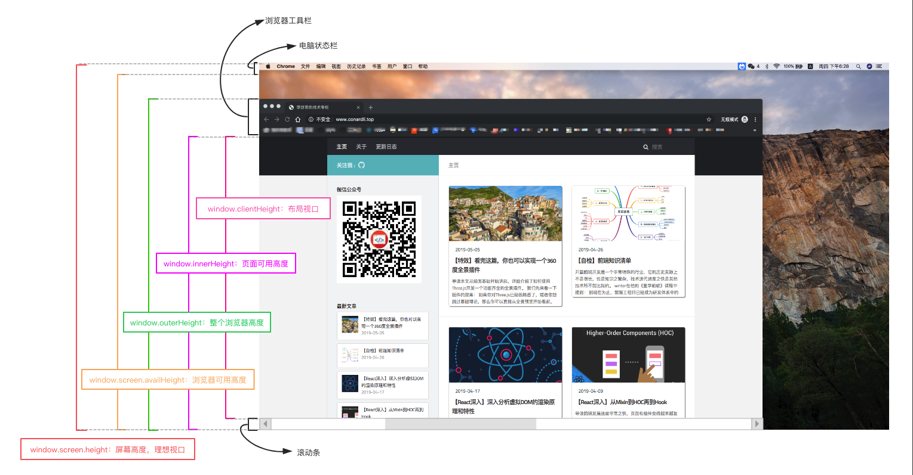
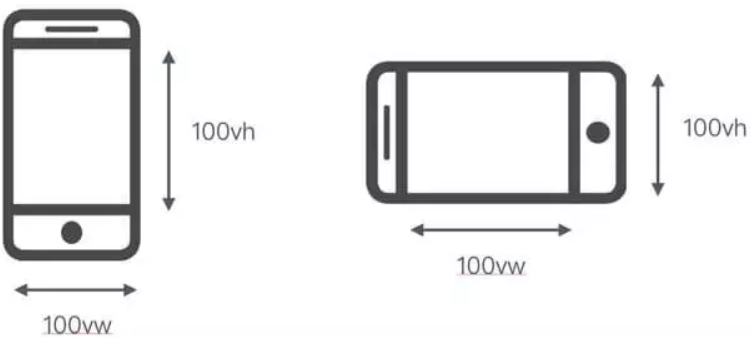
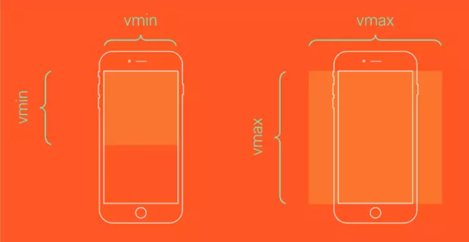
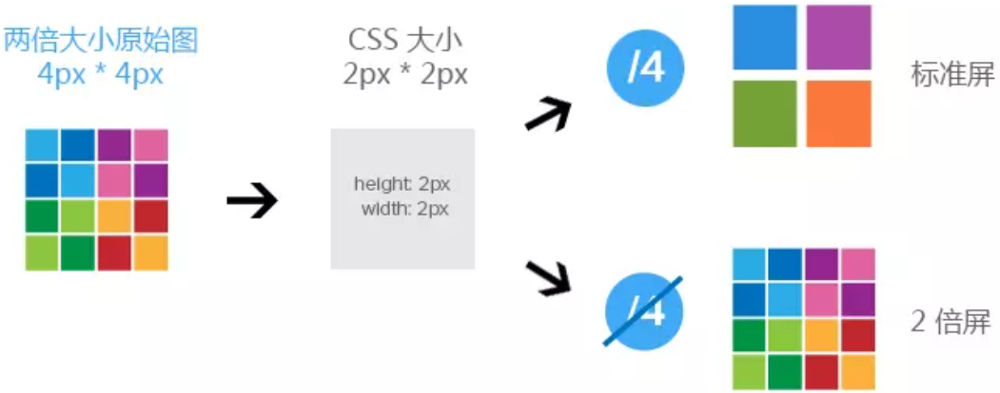

### 题目来源
[关于移动端适配，你必须要知道的](https://juejin.im/post/5cddf289f265da038f77696c#heading-1)

### 1. 视口
视口(`viewport`)代表当前可见的计算机图形区域。在`web`浏览器术语中，通常与浏览器窗口相同，但不包括浏览器的`UI`，菜单栏等 —— 即用户正在浏览的文档部分

通常所说的视口供包含三种：
+ 布局视口
+ 视觉视口
+ 理想视口

#### 1.1 布局视口 (layout viewport)

当我们以百分比来指定一个像素的大小时，其计算值是由这个元素的包含块计算而来的。当这个元素是最顶级的元素时，按照布局窗口来进行计算。

布局视口是网页布局的基准窗口，在`PC`浏览器上，布局视口就等于当前浏览器的窗口大小（不包括`borders`, `margins`, 滚动条）

移动端，布局窗口被赋予一个默认值，大部分是`980px`, 这保证`PC`的网页可以在手机浏览器上，但是非常小，用户可以手动对网页进行放大。

通过调用`document.documentElement.clientWidth / clientHeight`获取布局视口的大小。

#### 1.2 视觉视口 (visual viewport)
用户通过屏幕真实看到的区域

视觉视口默认等于当前浏览器的窗口大小（包括滚动条宽度）

当用户对浏览器进行缩放时，不会改变布局视口的大小，所以页面布局是不变的，但是缩放会改变视觉视口的大小。

例如：用户将浏览器窗口放大了`200%`，这时浏览器窗口中的`CSS`像素会随着视觉视口的放大而放大，这时一个`CSS`像素会跨越更多的物理像素。

我们可以通过调用`window.innerWidth / innerHeight`来获取视觉视口大小。

#### 1.3 理想视口 (ideal viewport)
布局视口在移动端展示的效果并不是一个理想的效果，所以理想视口(`ideal viewport`), 网站页面在移动端展示的理想大小。

`页面的缩放系数 = CSS像素 / 设备独立像素`，实际上说`页面的缩放系数 = 理想视口宽度 / 视觉视口宽度`更为准确。

所以，当页面缩放比例为`100%`时，`CSS像素 = 设备独立像素`，`理想视口 = 视觉视口`。

我们可以通过调用`screen.width / height`来获取理想视口大小。

#### 1.4 meta viewport
`<meta>` 元素表示那些不能由其它HTML元相关元素之一表示的任何元数据信息，它可以告诉浏览器如何解析页面。

我们可以借助`<meta>`元素的`viewport`来帮助我们设置视口、缩放等，从而让移动端得到更好的展示效果。
```js
<meta name="viewport" content="width=device-width; initial-scale=1; maximum-scale=1; minimum-scale=1; user-scalable=no;">
```
上面是`viewport`的一个配置，我们来看看其具体含义
`value` | 可能值 | 描述
- | - | -
`width` | 正整数或`device width` | 以`pixels`(像素)为单位，定义布局视口的宽度
`height` | 正整数或`device height` | 以`pixels`(像素)为单位，定义布局视口的高度
`initial-scale` | `0.0 - 10.0` | 定义页面初始缩放比例
`minimum-scale` | `0.0 - 10.0` | 定义缩放的最小值; 必须小于或等于`maximum-scale`的值
`maximum-scale` | `0.0 - 10.0` | 定义缩放的最大值; 必须大于或等于`minimum-scale`的值
`user-scalable` | 一个布尔值（`yes`或`no`） | 如果设置为`no`, 用户将不能放大或缩小网页，默认值为`yes`

#### 1.5 移动端适配
为了在移动端让页面获得更好的显示效果，我们必须让`布局视口`、`视觉视口`都尽可能等于`理想视口`

`device-width`就等于理想视口的宽度，所以设置`width=device-width`就相当于让布局视口等于理想视口。

由于`initial-scale = 理想视口宽度 / 视觉视口宽度`, 所以我们设置`initial-scale=1`; 就相当于让视觉视口等于理想视口

这时，1个`css`像素就等于1个设备独立像素，而且我们也是基于理想视口来进行布局的，所以呈现出来的页面布局在各种设备上都能大致相似。

#### 1.6 缩放
上面提到`width`可以决定布局视口的宽度，实际上它并不是布局视口的唯一决定性因素，设置`initial-scale`也有肯能影响到布局视口，因为布局视口宽度取的是`width`和`视觉视口宽度`的最大值。

例如：若手机的理想视口宽度为`400px`，设置`width=device-width`，`initial-scale=2`，此时`视觉视口宽度 = 理想视口宽度 / initial-scale`即`200px`，布局视口取两者最大值即`device-width = 400px`。

若设置`width=device-width，initial-scale=0.5`，此时`视觉视口宽度 = 理想视口宽度 / initial-scale`即`800px`，布局视口取两者最大值即`800px`。

#### 1.7 获取浏览器各个窗口大小
浏览器为我们获取窗口大小的`API`有很多

+ `window.innerHeight`：获取浏览器视觉视口高度（包括垂直滚动条）
+ `window.outerHeight`：获取浏览器窗口外部的高度。表示整个浏览器窗口的高度，包括侧边栏、窗口镶边和调正窗口大小的边框。
+ `window.screen.Height`：获取获屏幕取理想视口高度，这个数值是固定的，设备的分辨率/设备像素比
+ `window.screen.availHeight`：浏览器窗口可用的高度。
+ `document.documentElement.clientHeight`：获取浏览器布局视口高度，包括内边距，但不包括垂直滚动条、边框和外边距。
+ `document.documentElement.offsetHeight`：包括内边距、滚动条、边框和外边距。
+ `document.documentElement.scrollHeight`：在不使用滚动条的情况下适合视口中的所有内容所需的最小宽度。测量方式与clientHeight相同：它包含元素的内边距，但不包括边框，外边距或垂直滚动条。

### 2 `1px`问题
为了适配各种屏幕，一般使用设备独立像素来对页面进行布局。

在设备像素比大于1的屏幕上，我们写得`1px`实际上是被多个物理像素渲染，这就会出现`1px`在有些屏幕上看起来很粗的现象。

#### 2.1 `border-image`
基于`media`查询判断不同的设备像素比，并给定不同的`border-image`
```css
.border_1px {
    border-bottom: 1px solid #000;
}
@media only screen and (-webkit-min-device-pixel-ratio:2) {
    .border_1px {
        border-bottom: none;
        border-width: 0 0 1px 0;
        border-image: url(../img/1pxline.png) 0 0 2 0 stretch;
    }
}
```
#### 2.2 `background-image`
和`border-image`类似，准备一张符合条件的边框背景图，模拟在背景上。
```css
.border_1px {
    border-bottom: 1px solid #000;
}
@media only screen and (-webkit-min-device-pixel-ratio:2) {
    .border_1px {
        background: url(../img/1pxline.png) repeat-x left bottom;
        background-size: 100% 1px;
    }
}
```

上面两种都需要单独准备图片，而且圆角不是很好处理，但是可以应对大部分场景。

#### 2.3 伪类 + `transform`
```css
.border_1px:before {
    content: '';
    position: absolute;
    top: 0;
    height: 1px;
    width: 100%;
    background-color: #000;
    transform-origin: 50% 0%;
}

@media only screen and (-webkit-min-device-pixel-ratio:2) {
    .border_1px:before {
        transform: scaleY(0.5);
    }
}
@media only screen and (-webkit-min-device-pixel-ratio:3) {
    .border_1px:before {
        transform: scaleY(0.33);
    }
}
```
这种方式可以满足各种场景，如果需要满足圆角，只需要给伪类也加上`border-radius`即可。
#### 2.4 svg
上面的`border-image`和`background-image`都可以模拟`1px`边框，但是使用的都是位图，并且还需要外部引入。
借助于`PostCSS`的`postcss-write-svg`，能够直接使用`border-image`和`background-image`创建`svg`的`1px`边框：
```css
@svg border_1px {
    height: 2px;
    @rect {
        fill: var(--color, black);
        width: 100%;
        height: 50%;
    }
}
.example {
    border: 1px solid transparent;
    border-image: svg(border_1px param(--color #00b1ff)) 2 2 stretch;
}
```

### 3 移动端适配方案
尽管可以使用设备独立像素来保证各个设备在不同手机上显示的效果类似，但这并不能保证它们完全一直，我们需要一种方案来让设计稿得到更完美的适配。
#### 3.1 flexible方案
`flexible`方案是阿里早期开源的一个移动端适配解决方案，引用`flexible`后，在页面上统一使用`rem`布局
核心代码为：
```js
function setRemUnit() {
    var rem = docEl.clientWidth / 10
    docEl.style.fontSize = rem + 'px'
}
setRemUnit()
```
`rem`是相对于`html`节点的`font-size`来做计算的
通过设置`document.documentElement.style.fontSize`就可以统一整个页面的布局标准。

上面的代码中，将`html`节点的`font-size`设置为页面`clientWidth`(布局视口)的`1/10`，即`1rem`就等于页面布局视口的`1/10`, 这就意味着我们后面使用的`rem`都是按照页面比例来进行计算的。

这时，我们只需要将`UI`出的图转换为`rem`即可

以`iphone6`为例，布局视口为`375px`, 则`1rem = 37.5px`, 这时`UI`给定一个元素的宽为`75px`(设备独立像素), 我们只需要将其设置为`75 / 37.5 = 2rem`

可以借助`PostCSS`的`px2rem`插件来帮助我们完成这个过程。

随着`viewport`单位得到众多浏览器的兼容，上面这种方案已经被官方弃用。

#### 3.2 vh、vw方案
`vh, vw`方案是将视觉视口宽度`window.innerWidth`和视觉视口高度`window.innerHeight`等分为100份

上面的`flexible`方案就是模拟这种方案，因为早些时候，`vw`还未得到很好的兼容。
+ `vw(viewport's width)`: `1vw`等于视觉视口的`1%`
+ `vh(viewport's height)`: `1vh`为视觉视口高度的`1%`
+ `vmin`: `vw`和`vh`中较小值
+ `vmax`: 选取`vw`和`vh`中的较大值




`vw`方案的缺陷
+ `px`转换为`vw`不一定能够完全整除，因此有一定的像素差
+ 比如当容器使用`vw`, `margin`采用`px`时，很容易造成整体宽度超过`100vw`，从而影像布局效果，当然我们也是可以避免的，例如使用`padding`代替`margin`，结合`calc()`函数使用等。

### 4 适配iphoneX
#### 4.1 安全区域
`iphoneX`的出现，给手机设计带来了三个改动：圆角(`corners`)、刘海(`sensor housing`)和小黑条(`Home Indicator`)。

为了适配这些手机，安全区域概念诞生，安全区域就是一个不受上面三个效果的可视窗口范围
#### 4.2 viewport-fit
遇到的问题.png)
`viewport-fit`是专门为了适配`iPhoneX`而诞生的一个属性，它用于限制网页如何在安全区域内进行展示。
`contain`: 可视窗口完全包含网页内容
`cover`: 网页内容完全覆盖可视窗口

#### 4.3 env, constant
我们需要将顶部和底部合理地摆放在安全区域内，`IOS11`新增了两个`CSS`函数`env, constant`，用于设定安全区域与边界的距离

函数内部可以是四个常量：
+ `safe-area-inset-left`: 安全区域距离左边边界距离
+ `safe-area-inset-right`: 安全区域距离右边边界距离
+ `safe-area-inset-top`: 安全区域距离顶部边界距离
+ `safe-area-inset-bottom`: 安全区域距离底部边界距离

注意：必须指定`viewport-fit`后才能使用这两个函数：
```html
<meta name="viewport" content="viewport-fit=cover">
```
`constant`在`IOS < 11.2`版本中生效，`env`在`IOS >= 11.2`的版本中生效，这意味着我们往往要同时设置他们，将页面限制在安全区域内:
```css
body {
    padding-bottom: constant(safe-area-inset-bottom);
    padding-bottom: env(safe-area-inset-bottom);
}
```
当使用底部导航栏时，要为他们设置`padding`值:
```css
{
    padding-bottom: constant(safe-area-inset-bottom);
    padding-bottom: env(safe-area-inset-bottom);
}
```

### 5. 横屏显示
很多视口我们要对横屏和竖屏显示不同的布局，所以我们需要检测在不同的场景下，给定不同的样式
#### 5.1 JavaScript检测横屏
`window.orientation`: 获取屏幕旋转方向
```js
window.addEventListener("resize", ()=>{
    if (window.orientation === 180 || window.orientation === 0) { 
      // 正常方向或屏幕旋转180度
        console.log('竖屏');
    };
    if (window.orientation === 90 || window.orientation === -90 ){ 
       // 屏幕顺时钟旋转90度或屏幕逆时针旋转90度
        console.log('横屏');
    }  
});
```
#### 5.2 CSS检测横屏
```css
@media screen and (orientation: portrait) {
  /*竖屏...*/
} 
@media screen and (orientation: landscape) {
  /*横屏...*/
}
```

### 6. 图片模糊问题
#### 6.1 产生原因
我们平时使用的图片大多数属于位图(`png`, `jpg`...), 位图由一个个像素点构成，每个像素点都具有特定的位置和颜色值。

理论上，位图的每个像素对应在屏幕上使用一个物理像素来渲染，才能达到最佳的显示效果。

而在`dpr > 1`的屏幕上，位图的一个像素可能由多个物理像素来渲染，然而这些物理像素点并不能被准确的分配上对应位图像素的颜色，只能取近似值，所以相同的图片在`dpr > 1`的屏幕上就会模糊:

#### 6.2 解决方案
为了保证图片质量，我们应该尽可能让一个屏幕像素来渲染一个图片像素，所以，针对不同`DPR`的屏幕，我们需要展示不同分辨率的图片。

如：在`dpr=2`的屏幕上展示两倍图(`@2x`)，在`dpr=3`的屏幕上展示三倍图(`@3x`)。


#### 6.3 media查询
使用`media`查询判断不同的设备像素比来显示不同精度的图片。
```css
.avatar{
    background-image: url(conardLi_1x.png);
}
@media only screen and (-webkit-min-device-pixel-ratio:2){
    .avatar{
        background-image: url(conardLi_2x.png);
    }
}
@media only screen and (-webkit-min-device-pixel-ratio:3){
    .avatar{
        background-image: url(conardLi_3x.png);
    }
}
```

#### 6.4 image-set
使用`image-set`
```css
.avatar {
    background-image: -webkit-image-set( "conardLi_1x.png" 1x, "conardLi_2x.png" 2x );
}
```

#### 6.5 srcset
根据`img`标签的`srcset`属性，浏览器会自动根据像素密度匹配最佳显示的图片
```html

```

#### 6.6 JavaScript拼接图片url
使用`window.devicePixelRatio`获取设备像素比，遍历所有图片，替换图片地址:
```js
const dpr = window.devicePixelRatio;
const images =  document.querySelectorAll('img');
images.forEach((img)=>{
  img.src.replace(".", `@${dpr}x.`);
})
```

#### 6.7 使用svg
`SVG`的全称是可缩放矢量图(`Scalable Vector Graphics`), 不同于位图的基于像素，`SVG`则是属于对图像的形状描述，其本质为文本文件，体积较小，且不管放大多少倍都不会失真。

除了手动在代码中绘制`svg`，还可以像位图一样使用`svg`图片
```js


.avatar {
  background: url(conardLi.svg);
}
```