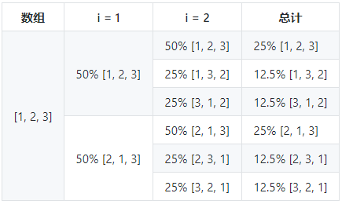

### 题目来源
好多地方看到

### 答案来源
[JavaScript专题之乱序](https://github.com/mqyqingfeng/Blog/issues/51)

### Math.random
```js
let values = [1, 2, 3, 4, 5]

values.sort(() => {
    return Math.random() - 0.5
})

console.log(values)
```

`Math.random() - 0.5`随机得到一个正数、负数或是0，如果是正数则降序排列，如果是负数则升序排列，如果是0，则保持不变。

这个方案看似很ok，但是效果却不是那么好，我们用一个demo测试一下：
```js
let times = [0, 0, 0, 0, 0]

for (let i = 0; i < 100000; i++) {
    let arr = [1, 2, 3, 4, 5]
    arr.sort(() => Math.random() - 0.5)
    times[arr[4] - 1]++
}

console.log(times)
```
一次随机的结果为:
```js
[24858, 7054, 21024, 18942, 28122]
```
结果表示，在10w次中，`1,2,3,4,5`这五个数的分布非常不均匀。

### 插入排序
问题的根源需要了解下`sort`函数的原理，ECMAScript只规定了效果，没有规定实现的方式，所以不同浏览器的实现方式是不一样的。

为了解决这个问题，以`v8`为例，`v8`处理`sort`方法时，当目标数组长度小于10时，使用插入排序，反之，使用快速排序和插入排序的混合排序。

插入排序的代码详见:[067.js实现各类排序.js](https://github.com/zhangwellyear/font-end/blob/master/067.js%E5%AE%9E%E7%8E%B0%E5%90%84%E7%B1%BB%E6%8E%92%E5%BA%8F.js)

### 具体分析
有了插入排序，我们具体分析下`[1, 2 ,3]`乱序的结果
演示代码:
```js
var values = [1, 2, 3]
values.sort(() => Math.random() - 0.5)
```

注意：此时`sort`函数底层是使用插入排序实现的，`InsertionSort`函数的`from`值为0，`to`的值为3。

逐步分析乱序的过程：
因为插入排序视第一个元素为有序的，所以数组的外层循环从 `i = 1`开始，`a[i]`的值为`2`, 此时内层循环遍历，比较`1`和`2`的值，因为`Math.random() - 0.5`的结果有50%的概率小于`0`, 有50%的概率大于0，所以有50%的概率数组变为`[2, 1, 3]`, 50%的结果不变，数组依然为`[1, 2, 3]`

假设依然是`[1, 2, 3]`, 再进行一次分析，接着遍历，`i=2`，`a[i]`的值为`3`，此时内层循环比较`2`和`3`。

有50%的概率数组不变，依然是`[1, 2, 3]`，然后遍历结束。

有50%的概率变成`[1, 2, 3]`, 因为还没有找到`3`的正确位置，所以还会进行遍历，所以在这`50%`的概率中又会进行一次比较`1`和`3`，有50%的概率不变，数组为`[1, 3, 2]`，此时遍历结束，有50%的概率发生变化，数组变为`[3, 1, 2]`

综上可得，在`[1, 2, 3]`中，有50%的概率会变成`[1, 2, 3]`，有25%的概率会变成`[1, 3, 2]`, 有25%的概率会变成`[3, 1, 2]`

将所有情况汇总为表格如下：


所以，出现上述情况的根本原因在于插入排序的算法中，当有待排序的元素与有序元素比较时，一旦确定了位置，就不会再跟位置前面的有序元素进行比较，所以乱序不够彻底。

### Fisher-Yates
为什么叫Fisher-Yates，因为这个算法是由Ronald Fisher和Frank Yates首次提出来的
```js
function shuffle(a) {
    let j, x, i
    for (i = a.length; i; i--) {
        j = Math.floor(Math.random() * i)
        x = a[i - 1]
        a[i - 1] = a[j]
        a[j] = x
    }

    return a
}
```

这个的原理极其简单，就是遍历数组，然后将当前元素与随机位置的元素进行交换，从代码中可以看出，这样的乱序会更加彻底。
```js
// ES6 代码
function shuffer(a) {
    for (let i = a.length; i; i++) {
        let j = Math.floor(Math.random() * i)
        [a[i - 1], a[j]] = [a[j], a[i - 1]]
    }
}
```