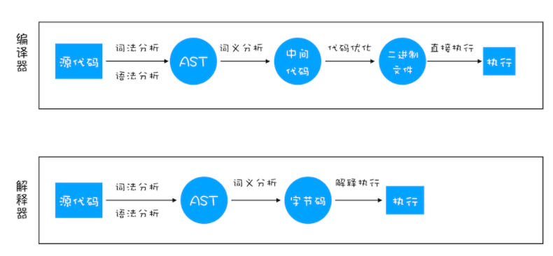

# V8的工作原理
- 编译器 (Compiler)
- 解释器 (Interpreter)
- 抽象语法树 (AST)
- 字节码 (Bytecode)
- 即时编译器 (JIT)

## 编译器和解释器

解释型语言不会根据`AST`生成字节码，再根据字节码生成执行程序，输出结果

## V8执行一段代码的过程

### 1. 生成抽象语法树（AST）和执行上下文
**Note:** 
1. `Babel`的工作原理是先将`ES6`源码转化为`ES6`语法的`AST`，然后将`ES6`语法的`AST`转换为`ES5`语法的`AST`，最后利用`ES5`的`AST`生成`JavaScript`源代码;
2. `ESLint`检测过程也需要将源码转化为`AST`，再通过`AST`语法树来检查代码规范化问题;

### 2. 生成字节码
解释器`Ignition`根据`AST`生成字节码，并解释执行字节码

### 3. 执行代码
**热点代码**（一段代码被重复执行多次），后台的编译器`TurboFan`就会把该段字节码转化为机器码，以提升执行效率

## 基于V8执行JS的原理，需注意的性能优化点
1. 提升单次`JavaScript`的执行速度，避免长任务占用主线程;
2. 避免大的内联脚本，解析`HTML`过程中，解析和编译也会占用主线程;
3. 减少`JavaScript`文件的容量，更小的文件会提升下载速度，占用更低内存。

